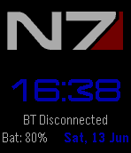
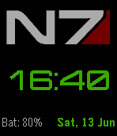

#  Jupiter Mass - a Pebble watchface

NOTE newer version (with different font) at https://github.com/clach04/watchface_JupiterMass

Basic digital watch face for the Pebble smartwatch. Features:
  * Updates once per minute
  * Includes battery status
  * Supports Aplite (original Pebble) and Basalt (Pebble Time)
  * Displays when Bluetooth connection is lost and optionally vibrates
  * Configurable color for time and date - Basalt (Pebble Time) ONLY

Acknowledgements

  * Font ISL Jupiter by Isurus Labs (http://www.dafont.com/isl-jupiter.font)
  * N7 Logo Vector by Karlika (http://karlika.deviantart.com/art/Mass-Effect-Vector-Pack-178422616)
  * html/js for color configuration based on code by https://github.com/rgarth and Slate https://github.com/pebble/slate

Store URL https://apps.getpebble.com/en_US/application/556a4727da4c418e7800006f
